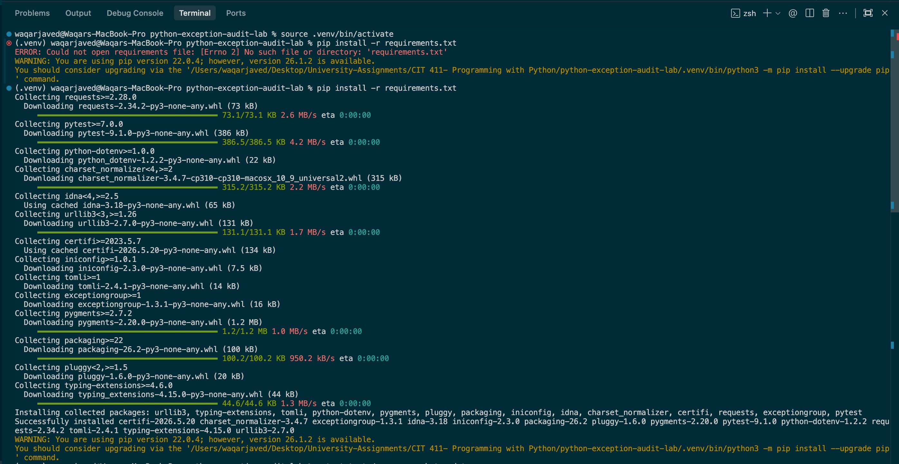
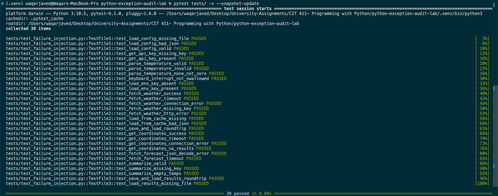
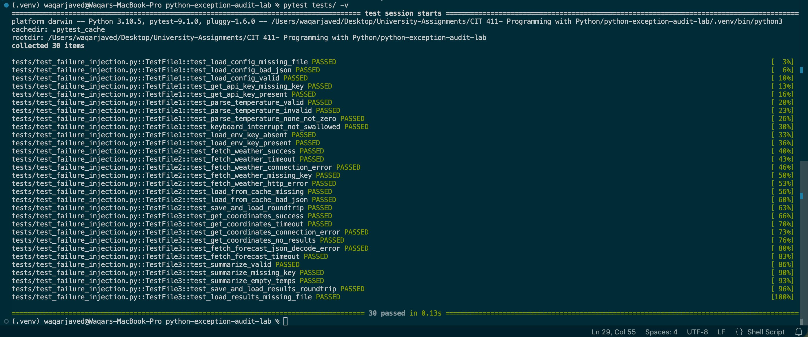

# 🐍 Python Exception-Handling Audit Lab

> **AI catches the unraisable; you catch what AI missed.**  
> A hands-on lab that teaches you to audit Python exception handling using AI as a first-pass tool — then validates every suggestion against the real docs.

[](https://github.com/iamwaqarjaved/python-exception-audit-lab/actions/workflows/ci.yml)


---

## 🎯 What This Lab Teaches

| Skill | Description |
|-------|-------------|
| **AI auditing** | Use Claude/ChatGPT as a fast first pass for exception reviews |
| **Validation** | Cross-check every AI suggestion against `docs.python.org` |
| **Unraisable detection** | Prove when an exception *cannot* fire on a given code path |
| **Failure injection** | Mock network calls and feed malformed input to test error paths |
| **Snapshot testing** | Lock expected outputs so regressions are caught automatically |

---

## 📁 Repo Structure

```
python-exception-audit-lab/
│
├── original/                   # The 3 buggy lab files (study these first)
│   ├── file1_bare_except.py    # 🔴 Bare except everywhere (over-catching)
│   ├── file2_no_handling.py    # 🔴 No exception handling at all
│   └── file3_mixed.py          # 🟡 Mixed quality (correct + wrong + obsolete)
│
├── refactored/                 # ✅ Fixed versions with validated exception handling
│   ├── file1_refactored.py
│   ├── file2_refactored.py
│   └── file3_refactored.py
│
├── tests/
│   ├── test_failure_injection.py   # 30 tests using mocks + malformed input
│   └── snapshots/                  # Committed golden outputs
│       ├── fetch_weather_success.txt
│       ├── summarize_valid_output.txt
│       └── ...
│
├── docs/
│   └── findings.md             # Full audit report: unraisable + missed exceptions
│
├── conftest.py                 # Pytest config: sys.path + snapshot fixture
├── requirements.txt
└── .github/workflows/ci.yml   # Runs on Python 3.10, 3.11, 3.12
```

---

## 🚀 Quick Start (macOS / Linux)

```bash
# 1. Clone
git clone https://github.com/YOUR_USERNAME/python-exception-audit-lab.git
cd python-exception-audit-lab

# 2. Create a virtual environment
python3 -m venv .venv
source .venv/bin/activate        # Windows: .venv\Scripts\activate

# 3. Install dependencies
pip install -r requirements.txt

# 4. Run all tests
pytest tests/ -v

# 5. Update snapshots (after intentional changes)
pytest tests/ -v --snapshot-update
```

Expected output:
```
30 passed in 0.20s ✅
```

---

## 🔬 The Three Lab Files Explained

### File 1 — `original/file1_bare_except.py` 🔴
Uses `bare except:` on every single try block. This is the most dangerous pattern:

```python
# BAD — swallows KeyboardInterrupt, SystemExit, everything
try:
    with open(CONFIG_PATH, "r") as f:
        data = json.load(f)
    return data
except:
    return {}
```

**What goes wrong:** Ctrl-C stops working. Background threads can't signal the process. Real errors become invisible.

### File 2 — `original/file2_no_handling.py` 🔴
Calls the Open-Meteo weather API with **no timeout and no error handling**:

```python
response = requests.get(url, params=params)   # hangs forever on slow network
data = response.json()
return data["current_weather"]["temperature"]  # KeyError if API schema changes
```

**What goes wrong:** The program hangs indefinitely on network issues; schema changes crash it silently.

### File 3 — `original/file3_mixed.py` 🟡
Has exception handling, but with three critical mistakes:

```python
except ValueError:    # ❌ requests never raises ValueError — it raises JSONDecodeError
    return {}
except IOError:       # ❌ IOError is an obsolete alias for OSError since Python 3.3
    return {}
```

And this silent dead-code bug:
```python
except FileNotFoundError:   # ❌ open() in 'w' mode CREATES the file — FNF never fires here
    print("Could not save results")
```

---

## 🧪 Snapshot Testing

Snapshots lock the expected output of key functions so regressions are caught automatically.

```
tests/snapshots/
  fetch_weather_success.txt          → "31.5"
  summarize_valid_output.txt         → "7-day avg max: 30.0°C"
  fetch_weather_schema_error_msg.txt → "Unexpected API schema – missing key 'current_weather'"
  ...
```

**First-time setup** (writes snapshots):
```bash
pytest tests/ -v --snapshot-update
```

**Normal runs** (compares against committed snapshots):
```bash
pytest tests/ -v
```

If a snapshot doesn't match, pytest tells you exactly what changed:
```
Snapshot mismatch for 'summarize_valid_output':
  Expected: '7-day avg max: 30.0°C'
  Got:      '7-day average: 30.0°C'

Re-run with --snapshot-update to accept new output.
```

---

## 🔍 Key Findings

### ❌ Unraisable Exceptions (AI Got These Wrong)

| Exception | Where Suggested | Why It Cannot Raise |
|-----------|----------------|---------------------|
| `TypeError` | `open(CONFIG_PATH)` | `CONFIG_PATH` is a hard-coded `str` literal; `open()` only raises `TypeError` for non-path-like types |
| `FileNotFoundError` | `open(path, 'w')` | Write mode uses `O_CREAT` — the OS creates the file if absent |
| `OverflowError` | `float(string)` | Python string → float conversion never overflows; only C-level doubles can |
| `EnvironmentError` | `os.environ[key]` | `EnvironmentError` is an `OSError` alias; dict-style env access only raises `KeyError` |
| `UnicodeDecodeError` | `response.json()` | `requests` decodes internally; the caller never handles raw bytes |

### ✅ Missed Realistic Exceptions (AI Missed These)

| Exception | Where | Why It Matters |
|-----------|-------|---------------|
| `requests.exceptions.Timeout` | `requests.get()` with no `timeout=` | Without `timeout=N`, the call hangs **forever** on a slow server |
| `KeyError` | `data["current_weather"]["temperature"]` | API schema can change; assumes a fixed response structure |
| `ZeroDivisionError` | `sum(temps) / len(temps)` | Empty forecast list → division by zero |

---

## 📋 Validation Process (for your own code)

Use this checklist before trusting any AI exception audit:

```
For every external boundary (file I/O, HTTP, subprocess, DB):

  □ Resource absent?      → FileNotFoundError, KeyError
  □ No permission?        → PermissionError (OSError subclass)  
  □ Wrong format?         → json.JSONDecodeError, ValueError
  □ Timeout?              → requests.exceptions.Timeout (requires timeout= param!)
  □ Schema changed?       → KeyError on dict access
  □ Version correct?      → IOError obsolete since Python 3.3; JSONDecodeError since requests 2.28
  □ Is this value always a str? → Then TypeError cannot raise
  □ Is this file always opened in 'w'? → Then FileNotFoundError cannot raise
```

---

## 🏃 Running on macOS — Step by Step

```bash
# Check Python version (need 3.10+)
python3 --version

# Clone and enter repo
git clone https://github.com/YOUR_USERNAME/python-exception-audit-lab.git
cd python-exception-audit-lab

# Create isolated environment
python3 -m venv .venv
source .venv/bin/activate

# Install
pip install -r requirements.txt

# First run — generates snapshots
pytest tests/ -v --snapshot-update

# Subsequent runs — validates against snapshots
pytest tests/ -v

# Run with coverage (optional)
pip install pytest-cov
pytest tests/ -v --cov=refactored --cov-report=term-missing
```

---

## 🤝 Contributing

1. Fork the repo
2. Create a branch: `git checkout -b fix/my-finding`
3. Add a test in `tests/test_failure_injection.py` that proves your finding
4. Run `pytest tests/ -v --snapshot-update`
5. Open a PR with a clear description of what exception is wrong and why

---

## 📚 References

- [Python Exception Hierarchy](https://docs.python.org/3/library/exceptions.html)
- [Python `open()` docs](https://docs.python.org/3/library/functions.html#open)
- [requests Exception Docs](https://requests.readthedocs.io/en/latest/api/#exceptions)
- [PEP 3151 — OSError/IOError unification](https://peps.python.org/pep-3151/)
- [requests 2.28 changelog — JSONDecodeError](https://github.com/psf/requests/blob/main/HISTORY.md)

---

## 📄 License

MIT — use freely for learning, teaching, or portfolio projects.

---

## ✅ Verified on macOS (Local Run Proof)

All 30 tests confirmed passing on a real MacBook Pro — Python 3.10.5, pytest 9.1.0.

### Step 1 — Install dependencies


### Step 2 — First run: write snapshots (`--snapshot-update`)


### Step 3 — Clean run: validate against snapshots


> **Platform:** darwin · Python 3.10.5 · pytest 9.1.0 · pluggy 1.6.0
